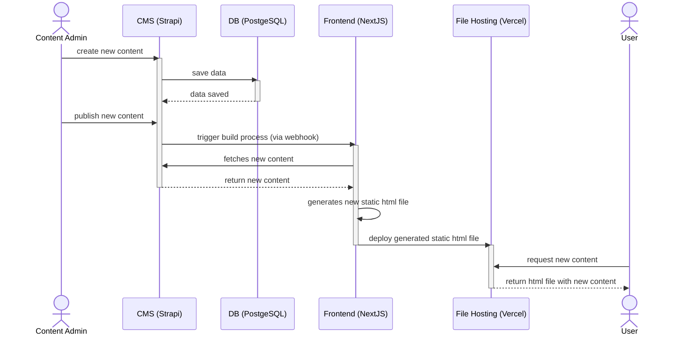

# Content Flow

This sequence diagram displays the process starting with the content creation until the consumption by the user.

```mermaid
sequenceDiagram
    actor Content Admin
    participant CMS (Strapi)
    participant DB (PostgeSQL)
    participant Frontend (NextJS)
    participant File Hosting (Vercel)
    actor User
    Content Admin->>CMS (Strapi): create new content
    activate CMS (Strapi)
    CMS (Strapi)->>DB (PostgeSQL): save data
    activate DB (PostgeSQL)
    DB (PostgeSQL)-->>CMS (Strapi): data saved
    deactivate DB (PostgeSQL)
    Content Admin->>CMS (Strapi): publish new content
    CMS (Strapi)->>Frontend (NextJS): trigger build process (via webhook)
    activate Frontend (NextJS)
    Frontend (NextJS)->>CMS (Strapi): fetches new content
    CMS (Strapi)-->>Frontend (NextJS): return new content
    deactivate CMS (Strapi)
    Frontend (NextJS)->>Frontend (NextJS): generates new static html file
    Frontend (NextJS)->>File Hosting (Vercel): deploy generated static html file
    deactivate Frontend (NextJS)
    activate File Hosting (Vercel)
    User->>File Hosting (Vercel): request new content
    File Hosting (Vercel)-->>User: return html file with new content
    deactivate File Hosting (Vercel)
```
